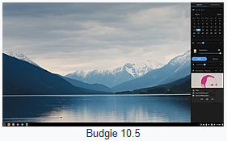
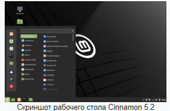
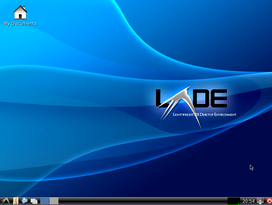
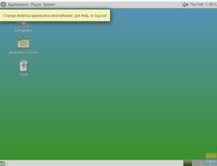
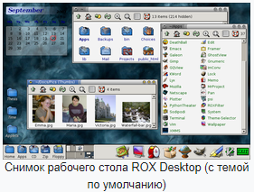
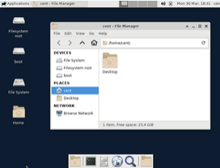
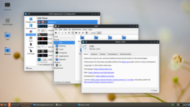
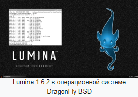
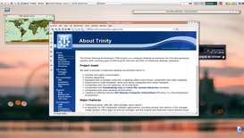

## [Назад](../lin.md)

### 
Среда рабочего стола ✔️

 `- разновидность графических интерфейсов пользователя, основанная на метафоре рабочего стола.`
 
### Основа GTK ✔️
   `- кроссплатформенная библиотека элементов интерфейса (фреймворк)`

- <b>Budgie</b> разрабатывается независимой организацией Buddies Of Budgie (ранее в составе проекта Solus), а также вкладчиками из многочисленных сообществ, таких как openSUSE Tumbleweed, Arch Linux и Ubuntu Budgie.
- 

- <b>Cinnamon</b> В данный момент Cinnamon используется в следующих дистрибутивах GNU/Linux: Mint, Fedora 18 и выше Netinstall/DVD, Snowlinux, Manjaro, Debian GNU/Linux,Ubuntu, ALT Linux, openSUSE, Calculate и, Arch Linux, Mageia. Также Cinnamon поддерживается в FreeBSD.
- 

- <b>GNOME </b> свободная среда рабочего стола для UNIX-подобных операционных систем. GNOME не является частью проекта GNU. GNOME — акроним от англ. GNU Network Object Model Environment («среда сетевой объектной модели GNU»).
- 

- <b>LXDE </b> свободная среда рабочего стола для UNIX и других POSIX-совместимых систем, таких как Linux или BSD. LXDE — стандартная среда рабочего стола для Knoppix, Lubuntu (до октября 2018), LXLE и Raspbian.
- 

- <b>MATE </b>среда рабочего стола, являющаяся ответвлением от кодовой базы не поддерживаемой в настоящее время среды GNOME 2. MATE является одной из сред рабочего стола по умолчанию в дистрибутивах: Linux Mint, Sabayon Linux, Fedora DVD/Netinstall, ALT Linux P7 и Porteus. Также доступны пакеты для openSUSE, Arch Linux, Debian GNU/Linux, Ubuntu, FreeBSD, Calculate, Gentoo, Sabayon и Cygwin. Начиная с Debian 8, Ubuntu 14.04, Arch с марта 2014 и выше пакеты с MATE лежат в официальных репозиториях, что позволяет устанавливать дистрибутив с помощью сетевого установщика с MATE по умолчанию. Сейчас добавлены у Debian и Ubuntu официальные образы с Mate.
- 

- <b>ROX Desktop </b> свободная среда рабочего стола для UNIX-совместимых операционных систем, базирующаяся на файловом менеджере ROX-Filer.
- 

- <b>Xfce </b> свободная среда рабочего стола для UNIX-подобных операционных систем, таких, как GNU/Linux, NetBSD, OpenBSD, FreeBSD, Solaris и т. п. Конфигурация данной среды полностью управляется мышью, конфигурационные файлы скрыты от пользователя.
- 

 

### Основа Qt ✔️
`- фреймворк для разработки кроссплатформенного программного обеспечения на языке программирования C++`

- <b>KDE Plasma 5 </b> среда рабочего стола, созданная сообществом KDE для систем Linux. Весной 2015 года Plasma 5 заменила Plasma 4 во многих популярных дистрибутивах, таких как Fedora 22, Kubuntu 15.04, и openSUSE Tumbleweed.
- 

- <b>LXQt </b> комплект разрабатываемых программных пакетов для Linux, нацеленный на обеспечение полноценной графической оболочки (среда рабочего стола). Он появился в результате слияния LXDE и Razor-qt.
- 

- <b>Lumina  </b> свободная среда рабочего стола для UNIX-подобных операционных систем, развиваемая проектом PC-BSD, в первую очередь для TrueOS (бывший PC-BSD) и FreeBSD.
- 

- <b>TDE  </b> среда рабочего стола, являющаяся ответвлением от кодовой базы неподдерживаемой в настоящее время среды KDE 3. Готовые бинарные пакеты доступны для Debian, Ubuntu, Fedora, RHEL/CentOS, Mandriva, Mageia, openSUSE и Arch Linux.
- 

## [Назад](../lin.md)

