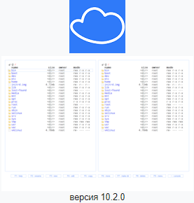
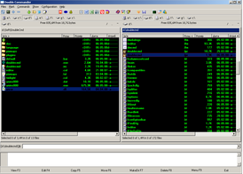
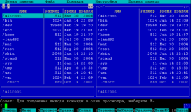
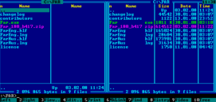
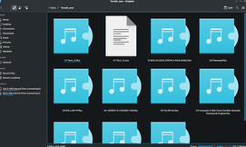
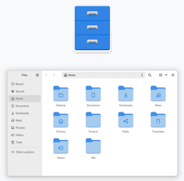
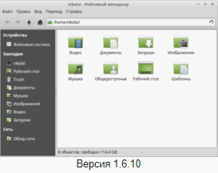
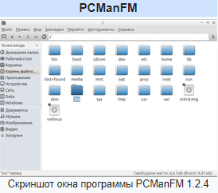
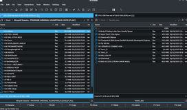
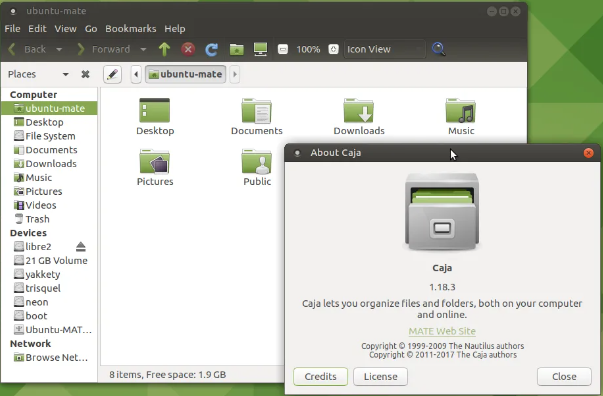

## [Назад](../lin.md)

## 
Файловый менеджер ✔️

 `- компьютерная программа, предоставляющая интерфейс пользователя для работы с файловой системой и файлами. Файловый менеджер позволяет выполнять наиболее частые операции над файлами — создание, открытие/проигрывание/просмотр, редактирование, перемещение, переименование, копирование, удаление, изменение атрибутов и свойств, поиск файлов и назначение прав. Помимо основных функций, многие файловые менеджеры включают ряд дополнительных возможностей, например, таких, как работа с сетью (через FTP, NFS и т. п.), резервное копирование, управление принтерами и пр.`
 
### Кроссплатформенные ✔️
`- способность программного обеспечения работать с несколькими аппаратными платформами или операционными системами предназначенное для работы в операционных системах Linux и Windows одновременно.`

##### Cloud Commander

- двухпанельный файловый менеджер для операционных систем: Linux, Windows и Mac OS. Программа написана на языке программирования JavaScript.
- 

##### Double Commander

- двухпанельный файловый менеджер с открытым исходным кодом, работающий под Linux (два варианта, с использованием библиотек GTK+ или Qt), Microsoft Windows, а также в macOS и FreeBSD. Свободными аналогами являются GNOME Commander и Sunflower (для среды GNOME) и Krusader (для среды KDE). Проприетарным аналогом является Total Commander, Unreal Commander для Microsoft Windows.
- 

##### GNU Midnight Commander

- один из файловых менеджеров с текстовым интерфейсом типа Norton Commander для UNIX-подобных операционных систем, а также Microsoft Windows
- 

##### FAR Manager

- консольный файловый менеджер для операционных систем семейства Microsoft Windows и Linux. Программа FAR Manager наследует двухоконную идеологию, стандартную расцветку и управление с клавиатуры у известного файлового менеджера Norton Commander.
- 

## Linux ✔️

#### Dolphin (KDE Plasma)
- файловый менеджер и часть проекта KDE SC. Используется как файловый менеджер по умолчанию в среде KDE, начиная с версии 4.0, вышедшей 11 января 2008 года
- 

#### Nautilus | GNOME Files (GNOME)
- официальный файловый менеджер для среды рабочего стола GNOME. Интерфейс GNOME Files очень похож на интерфейс Thunar (официальный файловый менеджер среды Xfce).
- 

#### Thunar (Xfce)
- файловый менеджер для среды рабочего стола Xfce, с версии Xfce 4.4 заменивший ранее использовавшийся Xffm. Интерфейс Thunar очень похож на интерфейс GNOME Files (стандартный файловый менеджер среды GNOME).
- 

#### PCManFM (LXDE)
- стандартный файловый менеджер среды LXDE с открытым исходным кодом, представляющей собой набор приложений, независимых друг от друга, но объединённых принципом экономии ресурсов. Продукт разрабатывается тайваньским программистом Hong Jen Yee, разработчиком графической среды LXDE.
- 

#### Krusader
- двухпанельный файловый менеджер для оболочки KDE.
- 

#### Caja
- это современный файловый менеджер для рабочей среды MATE.
- 

#### Demos Commander (Deco) 
- файловый менеджер с открытым исходным кодом, работающий на платформе Unix.

## [Назад](../lin.md)