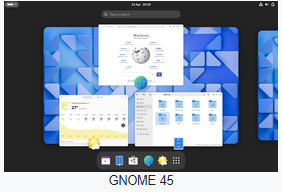
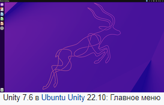
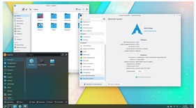

## [Назад](../lin.md)

### 
Графическая оболочка ✔️

`- это то, что вы видите на экране, когда работаете с компьютером. Это интерфейс, предоставляющий вам доступ к приложениям, файлам и ресурсам вашей операционной системы.`

#### GNOME Shell
- Графическая оболочка среды рабочего стола GNOME. GNOME Shell управляет рабочим столом и отвечает за такие базовые функции, как запуск приложений и переключение между окнами. GNOME Shell тесно интегрирован с Mutter, который является следующим поколением оконного менеджера Metacity.\

#### Unity
-  свободная оболочка для среды рабочего стола GNOME, разрабатываемая компанией Canonical для дистрибутива GNU/Linux Ubuntu. Unity — оболочка рабочего стола для GNOME. Это не абсолютно новая среда рабочего стола. Оболочка рабочего стола — интерфейс, который вы видите. Unity будет использовать те же приложения и библиотеки GNOME, что используются сейчас. К примеру, GNOME shell — ещё одна оболочка для GNOME.
- 

#### KDE
- международное сообщество, разрабатывающее свободную среду рабочего стола KDE Plasma, набор связанных между собой программ, а также несколько веб-сервисов
- 