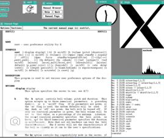
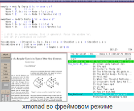
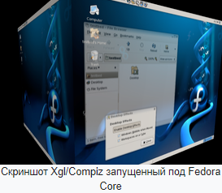
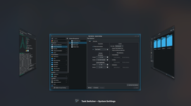
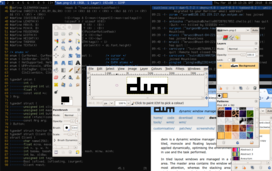

## [Назад](../lin.md)

### 
Менеджер окон ✔️

`- отвечает за управление окнами на рабочем столе, такими как их расположение, размер, границы и заголовки. Он также предоставляет функции, такие как сворачивание, разворачивание и перемещение окон.`

#### X Window System
-  оконная система, обеспечивающая стандартные инструменты и протоколы для построения графического интерфейса пользователя. Используется в UNIX-подобных ОС. X Window System обеспечивает базовые функции графической среды: отрисовку и перемещение окон на экране и взаимодействие с устройствами ввода, такими как, мышь и клавиатура. X Window System не определяет деталей интерфейса пользователя — этим занимаются менеджеры окон, которых разработали множество. По этой причине внешний вид программ в среде X Window System может очень сильно различаться в зависимости от возможностей и настроек конкретного оконного менеджера.
- 

### Некоторые менеджеры окон X Window System ✔️

#### Mutter (GNOME)
- оконный менеджер X Window System, который используется по умолчанию в рабочей среде GNOME 3. Mutter был разработан в качестве альтернативы Metacity.
- 

#### xmonad
-  фреймовый оконный менеджер для X Window System, написанный на функциональном языке программирования Haskell. xmonad распространяется со многими Unix-подобными операционными системами, в том числе, Linux (Arch Linux, Debian, Fedora Linux,Ubuntu, Gentoo), BSD (FreeBSD, NetBSD, OpenBSD). 
- 

#### Compiz
-  композитный менеджер окон для X Window System, использующий для ускорения 3D графики OpenGL. Он предоставляет множество новых графических эффектов, доступных в любых графических средах X Window, в том числе GNOME и KDE. Представляет собой комплекс плагинов, декораторов, инструментов настройки интерфейса и эффектов.
- 

#### KWin (KDE Plasma)
-  оконный менеджер для X Window System, на данный момент находится в процессе перехода на Wayland compositor. Он выпущен как часть KDE Plasma 5, для которого он является оконным менеджером по умолчанию. KWin также можно использовать отдельно или вместе с другими графическими окружениями.
- 

#### dwm
- динамический тайлинговый оконный менеджер для оконного интерфейса X11. Менеджер окон dwm написан на языке C и может быть сконфигурирован под любые потребности.
- 

#### Xfwm (Xfce)

## [Назад](../lin.md)
