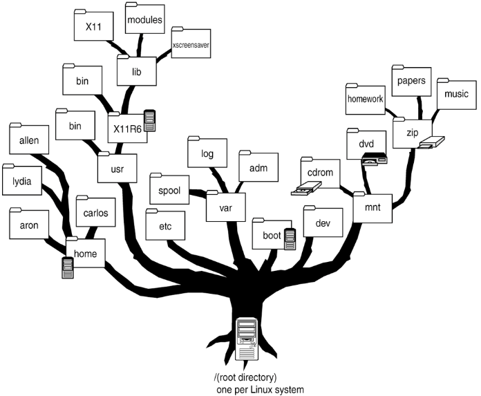
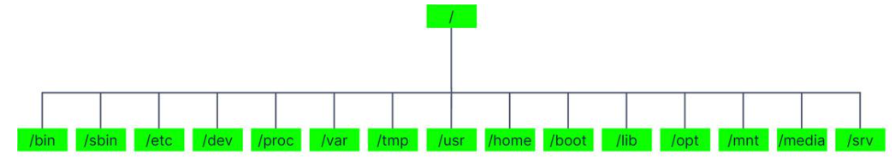

## [Назад](../lin.md)

### 
Файловая система ✔️

`- способ организации, хранения и именования данных на носителях информации.`

#### 
[Что такое файловая таблица ❓](../Other/ftable.md)

Она определяет, какого размера будут кластеры — блоки информации, на которые делится файл;
соединяет «кусочки» информации из разных кластеров в единые файлы;

`файл 🔰 - это блок информации, записанный на накопитель.`

- обеспечивает прикладным программам доступ к файлам;
- отслеживает, какие ячейки памяти сейчас свободны, заняты или недоступны;
- оптимизирует чтение и запись файлов, сжимает и кэширует;
- следит за целостностью и защищенностью файлов, создает точки восстановления;
- хранит информацию о файлах, в том числе название, размер и дату создания.

Иными словами, без файловой системы не получилось бы работать с файлами.
Она управляет хранилищем и делает разрозненную информацию в нем понятной для операционной системы и прикладного ПО.

#### 
[Что такое кластер ❓](../Other/kl.md)

#### Классификация файлов в Linux ✔️
В отличие от других ОС, где разные диски и разделы обладают собственными корневыми директориями, в Linux они монтируются в поддиректории внутри единой файловой иерархии.

##### В Linux есть несколько разновидностей файлов, которые выполняют свою уникальную функцию:

- <b>Обычные файлы (regular files).</b> Это самый обычный тип файлов, который чаще всего используется. Сюда относятся данные, текст, исходный код программ, медиаматериалы и прочее.
- <b>Именованные каналы (named pipes).</b> Необходимы для межпроцессного взаимодействия, позволяя одному процессу передавать данные другому.
- <b>Файлы устройств.</b> Содержат в себе символьные (char devices) и блочные (block devices) файлы, которые предоставляют внешние аппаратные устройства (например, HDD, принтеры и прочие).
- <b>Ссылки.</b> Включают два типа ссылок. Символические ссылки, или «симлинки», функционируют как ярлыки, указывающие на другие файлы или папки. Жесткие ссылки, в свою очередь, создают альтернативные пути доступа к одним и тем же физическим данным на диске, ведя себя как дубликаты файла без фактического дублирования содержимого.
- <b>Каталоги.</b> Это своего рода папки, где хранятся ссылки на файлы и другие каталоги. Они помогают организовать данные, распределяя их по разным «отсекам», чтобы было легче найти нужную информацию.
- <b>Сокеты.</b> Специальные файлы для обмена данными между разными процессами, как внутри одной системы, так и между разными компьютерами. Это своеобразные «почтовые ящики» для программ, через которые они могут «пересылать» друг другу информацию.
- <b>Двери (Doors).</b> Механизм в некоторых операционных системах, предназначенный для взаимодействия между программными процессами.

Файловая система Linux организована в форме иерархической структуры, которую образно можно представить в виде дерева.
- 

Корневой раздел в Linux один — «/» (root, «корень)». 

Директория корневого пользователя (~)

Разделы называются подкаталогами, примонтированными к соответствующим каталогам.
Разделы помогают организовать содержимое дисков в соответствии с типом и использованием содержащихся данных.

`* `/`: Корневой раздел, который содержит операционную систему и основные программы.
* `/home`: Домашний раздел, который содержит пользовательские файлы и настройки.
* `/var`: Раздел для изменяемых данных, таких как журналы и кэши.
* `/tmp`: Раздел для временных файлов.
* `/usr`: Раздел для пользовательских программ и библиотек.
* `/opt`: Раздел для дополнительных программ, установленных пользователем.
* `/boot`: Раздел для файлов загрузки, необходимых для загрузки операционной системы.`

Кроме того, временные файлы, созданные и уничтоженные во время нормальной работы Linux, могут располагаться на выделенных разделах.
Одним из преимуществ такого рода изоляции по типу и изменчивости является то, что, когда все доступное пространство в определенном разделе исчерпано, система все равно может работать нормально.

#### 
[Что такое разделы MBR и GPT ❓](../Other/mbcg.md)

### Структура каталогов в Linux ✔️
Структура каталогов относится к иерархической организации файлов и папок в файловой системе. Основные каталоги в структуре каталогов Linux:

* `/`: Корневой каталог, который содержит все другие каталоги и файлы.
* `/bin`: Содержит основные исполняемые файлы.
* `/boot`: Содержит файлы, необходимые для загрузки системы.
* `/dev`: Содержит файлы устройств, представляющих аппаратное обеспечение.
* `/etc`: Содержит конфигурационные файлы.
* `/home`: Содержит домашние каталоги пользователей.
* `/lib`: Содержит библиотеки, необходимые для запуска программ.
* `/media`: Содержит точки монтирования для съемных носителей.
* `/mnt`: Содержит точки монтирования для временно смонтированных файловых систем.
* `/opt`: Содержит дополнительные программы, установленные пользователем.
* `/proc`: Содержит информацию о запущенных процессах.
* `/root`: Домашний каталог пользователя root.
* `/run`: Содержит информацию о запущенной системе.
* `/sbin`: Содержит системные исполняемые файлы, доступные только пользователю root.
* `/srv`: Содержит данные, предоставляемые сервисами.
* `/tmp`: Содержит временные файлы.
* `/usr`: Содержит программы, библиотеки и документацию для пользователей.
* `/var`: Содержит изменяемые данные, такие как журналы и кэши.

Итак, структура разделов и структура каталогов в Linux - это разные, но взаимосвязанные концепции.
Структура разделов определяет логическое разделение жесткого диска, а структура каталогов определяет организацию файлов и папок внутри файловой системы.

Обзор типов файловых систем в Linux
Рассмотрим самые известные файловые системы для Linux:

- <b>Ext (Extended File System).</b> Является первой файловой системой, разработанной специально для Linux. Она представляла собой значительный шаг вперед по сравнению с предыдущими решениями, предоставляя лучшую производительность и возможности для Linux-систем.
- <b>Ext2 (Second Extended File System).</b> Была разработана как улучшение ext, предлагая лучшую надежность и управление ресурсами, а также поддержку большего размера данных и файлов. Эта система не использует журналирование, что делает ее менее предпочтительной для проектов, где важна высокая надежность данных, но по-прежнему эффективной для портативных устройств хранения данных. 
- <b>Ext3 (Third Extended File System).</b> Улучшенная версия ext2. Основным нововведением здесь является поддержка журналирования, что значительно повышает надежность и уменьшает время на восстановление после сбоев или некорректных выключений системы.
- <b>Ext4 (Fourth Extended File System).</b> Новейшее развитие в линейке Ext. Обладает улучшенной эффективностью, надежностью и масштабируемостью. Предлагает поддержку больших объемов хранения, а также ряд других технических усовершенствований.
- <b>XFS.</b> Высокопроизводительная и масштабируемая файловая система от компании SGI. Известна своей способностью эффективно работать с большими файлами и обширными наборами данных, что делает ее популярным выбором для серверов и систем хранения данных.
- <b>JFS (Journaled File System).</b> Создана компанией IBM, обладает высокой надежностью и эффективным использованием ресурсов, обеспечивая хорошую производительность даже при повышенных нагрузках.
- <b>Btrfs (B-Tree File System).</b> Разработана Oracle для повышения гибкости управления данными и обеспечения высокого уровня отказоустойчивости. Она включает в себя такие возможности, как проверка и восстановление данных на лету, эффективное сжатие и интеграцию множественных устройств в одну файловую систему.
- <b>Swap.</b> Позволяет системе использовать часть дискового пространства в качестве виртуальной памяти, когда физическая память (RAM) исчерпана. Это не файловая система в традиционном понимании, но она является важным элементом управления памятью Linux. 

#### 
[Что такое swap ❓](../Other/swap.md)

### Файловые системы по квалификациям: ✔️

**По способу организации данных:**

* **Блочные файловые системы:** Хранят данные в виде блоков фиксированного размера. Например, ext4, XFS, Btrfs.
* **Файловые системы на основе индексных дескрипторов:** Хранят метаданные файла (например, имя, размер, дату создания) отдельно от самих данных. Например, ZFS, ReFS, APFS.

#### 
[Что такое файловый дескриптор ❓](../Other/desc.md)

**По доступу к данным:**

* **Локальные файловые системы:** Хранят данные на локальном запоминающем устройстве (например, жестком диске или SSD). Например, ext4, NTFS, XFS.
* **Сетевые файловые системы:** Позволяют нескольким компьютерам совместно использовать данные, хранящиеся на центральном сервере. Например, NFS, SMB, CIFS.

**По устойчивости к ошибкам:**

* **Журналируемые файловые системы:** Записывают изменения в файл журнала перед обновлением самих данных. Это повышает вероятность восстановления данных в случае сбоя системы. Например, ext4, XFS, ZFS.
* **Нежурналируемые файловые системы:** Не используют журнал. Изменения данных записываются непосредственно на диск. Они менее устойчивы к ошибкам, но могут быть более быстрыми. Например, FAT32, NTFS (в режиме совместимости).

**По поддержке расширенных возможностей:**

* **Файловые системы с расширенными возможностями:** Поддерживают такие функции, как управление квотами, шифрование, снимки и т. д. Например, ext4, XFS, ZFS, Btrfs.
* **Файловые системы без расширенных возможностей:** Поддерживают базовые функции, такие как хранение и извлечение файлов. Например, FAT32, NTFS (в базовом режиме).

**Другие квалификации:**

* **Файловые системы для твердотельных накопителей (SSD):** Оптимизированы для работы с SSD, учитывая их особенности (например, отсутствие подвижных частей и ограниченный срок службы). Например, F2FS, Btrfs.
* **Файловые системы для виртуальных машин:** Разработаны для работы в виртуализированных средах, обеспечивая высокую производительность и совместимость. Например, VMFS, VHDX.
* **Специализированные файловые системы:** Разработаны для специфических целей, таких как хранение мультимедийных данных или данных баз данных. Например, GFS2 (для кластерных систем), ReiserFS (для высокопроизводительных баз данных).

#### 
[Что такое GRUB ❓](../Other/grub.md)

### Виртуальные и специализированные файловые системы в Linux ✔️

В дополнение к традиционным файловым системам в Linux часто применяются виртуальные и специализированные файловые системы, которые предназначены для конкретных задач.

Вот некоторые из них:

1. <b>EncFS (Encrypted File System)</b>: Файловая система на основе FUSE (Filesystem in Userspace), которая предназначена для прозрачного шифрования файлов.

2. <b>Aufs (Another Union File System)</b>: Слоистая файловая система, позволяющая объединять содержимое нескольких каталогов в один виртуальный каталог.
Таким образом обеспечивается удобное управление директориями из различных источников. Эта система часто применяется в Live CD и Docker-контейнерах.

3. <b>NFS (Network File System)</b>: Сетевая файловая система, которая дает возможность пользователям работать с файлами и папками на удаленных компьютерах,
так, как будто они находятся непосредственно на их собственном устройстве.

4. <b>ZFS (Zettabyte File System)</b>: Изначально разработана для Solaris (Sun Microsystems), а сейчас доступна и для некоторых дистрибутивов Linux (через проект OpenZFS).
ZFS известна своими возможностями в области управления хранилищем, включая поддержку высокого уровня интеграции данных и пула хранения, снимки состояния, клонирование и встроенное шифрование.

## [Назад](../lin.md)