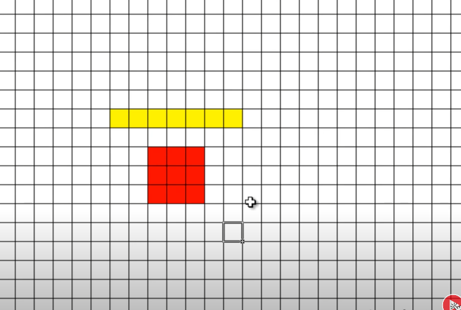

## [Назад](../FileSystem/fs.md)

### 
Файловая таблица ✔️

`- в ней приведена информация обо всех файлах.`

Не всегда эта информация записана последовательно,
иногда физически части одного и того же файла могут находиться в разных секторах жесткого диска.
Чтобы знать, что где хранится, у системы есть файловая таблица.

Файловая система определяет, как организовать эту таблицу.
Способы разные в зависимости от ОС, поэтому у разных операционных систем различаются и файловые системы.

`Таблица разделов - это структура, где содержится информация обо всех разделах на диске: как он называется (Label), откуда начинается, где заканчивается, какой объем имеет и т.д.`

