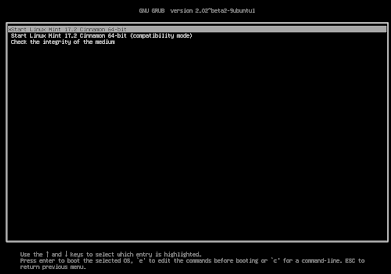

## [Назад](../FileSystem/fs.md)

### 
GRUB (Grand Unified Bootloader) ✔️

`- загрузчик операционной системы от проекта GNU. GRUB позволяет пользователю иметь несколько установленных операционных систем и при включении компьютера выбирать одну из них для загрузки.`

### Основные возможности GRUB

- StartUp-Manager: графический интерфейс для настройки GRUB
- Загрузка Linux, OpenSolaris, *BSD ядер и других Multiboot-совместимых ОС;
- Передача управления другим загрузчикам, возможность загрузки Windows-систем;
- Защита паролем пунктов меню;
- Поддержка BOOTP и TFTP для сетевой загрузки;
- Интерактивная командная строка загрузки;
- Поддержка популярных файловых систем: ext2/ext3/ext4, ReiserFS, JFS, XFS, NTFS, ISO, UFS, UFS2, FFS, FAT16, FAT32 и Minix, и чтение файлов конфигурации, ядер, initrd и других файлов прямо с файловой системы.
- Поддержка загрузчика EFI, начиная с версии 1.98 (загрузка операционных систем семейства Mac OS).
- Гибкая настройка внешнего вида с использованием тем для красивого интерфейса и обоев в загрузочном меню.
- Модульная структура в GRUB2 позволяет легкое добавление нового функционала и управление компонентами.

