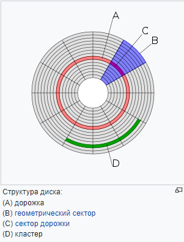

## [Назад](../FileSystem/fs.md)

### 
Кластер ✔️

`- логическая единица хранения данных в таблице размещения файлов, объединяющая группу секторов.`

Например, на дисках с размером секторов в 512 байт, 512-байтный кластер содержит один сектор, тогда как 4-килобайтный кластер содержит восемь секторов.

Как правило, это наименьшее место на диске, которое может быть выделено для хранения файла.
Понятие кластер используется в файловых системах FAT, NTFS, a так же HFS Plus. 

Другие файловые системы оперируют схожими понятиями (зоны в Minix, <b>блоки</b> в Unix).
Обычно кластер весит несколько байт, а сколько конкретно — зависит от размера диска и от настроек.
Когда человек настраивает файловую систему, он может выбрать и размер кластера:
если кластер сделать меньше рекомендованного, на накопитель поместится больше файлов.

Ведь тогда не будет ситуаций, когда кластер фактически заполнен лишь частично — все пространство окажется задействовано;
если увеличить размер кластера, доступ к файлам будет быстрее.
Файлы будут делиться на меньшее количество частей. Компьютеру придется обращаться к меньшему количеству кластеров — это увеличит скорость.

Файловая система управляет кластерами, тем, как они будут записываться и храниться, как между ними будут организованы связи.
Она же разделяет и распределяет файлы по кластерам, управляет записью и чтением.

