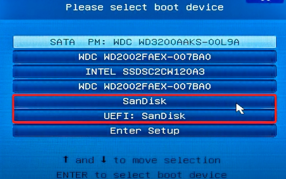

## [Назад](../FileSystem/fs.md)

### 
Разделы MBR и GPT ✔️

`GPT, и MBR выполняют одну и ту же функцию: Это небольшой участок на диске, в котором хранят информацию о разделах накопителя, подсказывая системе, какой из них является загрузочным и к какому разделу относится конкретный сектор диска.`

#### Master Boot Record  - главная загрузочная запись (BIOS)
- 2 тб
- 4 раздела (поскольку сама запись MBR тоже раздел, то доступны будут 3)
- Записывается в одном месте, и если произойдет произойдет повреждение загрузочной записи, то потеряем систему

#### GUID Partition Table - таблица разделов со статистически уникальным идентификатором (UEFI)
- 2 тб+
- 128 раздела (поскольку сама запись MBR тоже раздел, то доступны будут 3)
- Записывается в нескольких мест, и если произойдет произойдет повреждение загрузочной записи, то произойдет загрузка с другого места

ПРИМЕР
`используя программу rufus, в Схема раздела,
мы указываем MBR(он будет ориентирован на MBR и UEFI),
т.е при установке систему если мы выберем SanDisk(MBR), и если наш диск с разметкой MBR, то все будет работать, но если разметка на диске UEFI, а мы выберем загрузку MBR(SanDisk) то получим ошибку, что система не найдена
если мы уверены что  у нас GPT, то можем в самом rufuse это указать и тогда двух вариантов при F11 не будет, будет только UEFI: SanDisk`

##### Что лучше: GPT или MBR ?
Сказать, что GPT‑диски работают лучше или быстрее, нельзя, дело лишь в совместимости оборудования и возможностях.
Если компьютер и операционная система способны принять GPT, то следует использовать его, если нет — выбирайте MBR.
Из преимуществ последнего можно назвать только более широкую совместимость: 
MBR работает с UEFI и BIOS, а также поддерживает больше ОС.

Однако он не распознаёт диски объёмом свыше 2 ТБ и не позволяет создавать более четырёх разделов.
GPT гораздо функциональнее: он практически не имеет ограничений по количеству разделов и их величине.
Максимальный размер равен 9,4 ЗБ (зеттабайта), а это просто невероятно много: такой объём суммарно дадут 940 миллионов 10‑террабайтных накопителей.
