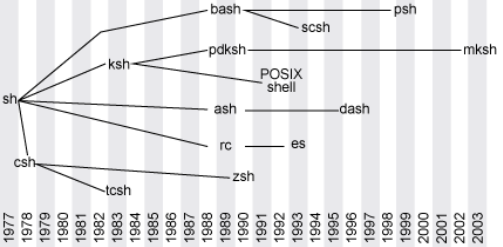

## [Назад](../lin.md)

### 
Оболочка операционной системы ✔️

- программа, предоставляющая интерфейс для взаимодействия пользователя с функциями системы.

В общем случае различают оболочки с двумя типами интерфейса для взаимодействия с пользователем:
- текстовый пользовательский интерфейс (Text user interface TUI✔️ также Character User Interface, CUI✔️)\
разновидность интерфейса пользователя, использующая при вводе-выводе и представлении информации исключительно набор буквенно-цифровых символов и символов псевдографики.
Характеризуется малой требовательностью к ресурсам аппаратуры ввода-вывода (в частности, памяти) и высокой скоростью отображения информации. 
 
 
- графический пользовательский интерфейс (GUI Graphical User Interface✔️) это способ взаимодействия пользователя с компьютером с использованием графических элементов, таких как окна, кнопки и меню.
 
 

- <b>Bourne shell (sh)</b>🔰: Основная стандартная оболочка в UNIX. Простой и стабильный интерпретатор команд.
- <b>Bourne-Again Shell (bash)</b>🔰: Расширение и улучшение Bourne shell. Стандартная оболочка в большинстве дистрибутивов Linux. Поддерживает историю команд, автодополнение, функции и многое другое.
- <b>Korn shell (ksh)</b>🔰: Расширенная оболочка, сочетающая возможности Bourne shell и C shell. Популярна в среде коммерческих UNIX-систем.
- <b>C shell (csh)</b>🔰: Оболочка с синтаксисом, подобным языку программирования C. Имеет командные файлы для автоматизации задач. 
- <b>Z shell (zsh)</b>🔰: Мощная и расширенная оболочка. Поддерживает удобное автодополнение, плагины, темы оформления и другие продвинутые функции.
- <b>Fish shell (fish)</b>🔰: Оболочка с уникальным подходом к синтаксису и функциям. Предлагает цветовое оформление команд, автодополнение на основе контекста и прозрачную историю команд. 

